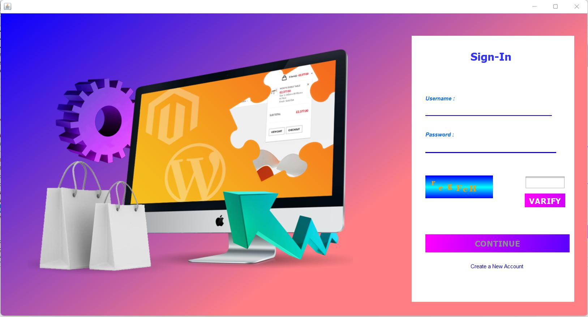

# Super_Market_Billing-Management_System

Built with JAVA on Apache NetBeans. Project
have an Interactive User-Interface Developed On Apache Netbeans using AWT,
For Security Purpose it consist a Login Page and Captcha Verification. The
project uses MySQL as Database to store data with help of JDBC drivers, This
data is used for printing receipt and can be further used for Analysis of Data .

The User-Interface is designed using AWT tools.

1st Page is Login Page : 

Which is Created For Existing User . There is also Captcha Verifaction , until captcha is not true user can't proceed.

If User do not have a account , he can create one through Registration Page , from one Phone number Only one Account can be created

Once the user logged-in, the First interface Looks Like :

In which on the top Right Corner there are two options , one for Logout and other one to close window .
On the left hand-Side bar , there man options like "Adding New Product" , "Update Product" ,"Customer List" .

To add new Buyer :

To add new Product :

To update Existing Buyer Details , we can Search them From unique Phone Number :

Similarly , there other pages for viewing product list , updating product list , changing product details ,etc.

The Billing Machine Looks Like :

In Which on Top Right Corner there is time and Date for Bill , In Name feild if We Enter first alphabet and press enter and if user exist the all the details of user get auto-filled .
We can also change details if user do not Exist.

we Can Search product From Product id and add them into List.

When we create on print button then a bill will generated , which will looks Like :

All the Data will Store in Mysql Using Xampp and Data in Database will looks like  :

In Future , the data can also be saved of Bill and can be utilize to analyze the puchasing pattern of person and to analyse seasonality in the Product Sales.

Thank You.
